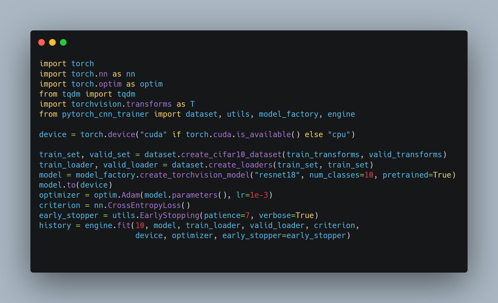

# PyTorch CNN Trainer


[](https://github.com/psf/black)


[](https://pepy.tech/project/pytorch-cnn-trainer)
[](https://pepy.tech/project/pytorch-cnn-trainer/month)
[](https://pepy.tech/project/pytorch-cnn-trainer/week)

## Train CNN for your task

A simple engine to fine tune CNNs from [torchvision](https://github.com/pytorch/vision) and [Pytorch Image models](https://github.com/rwightman/pytorch-image-models) from Ross Wightman.



## Why This Package ?

It is very annoying to write training loop and training code for CNN training. Also to support all the training features it takes massive time.

Usually we don't need distributed training and it is very uncomfortable to use argparse and get the job done.

This simplifies the training. It provide you a powerful `engine.py` which can do lot of training functionalities. 
Also a `dataset.py` to load dataset in common scenarios.

Note: - 
Pytorch Trainer is not a distributed training script.

It will work good for single GPU machine for Google Colab / Kaggle.

But for distributed Training you can use the PyTorch Lightning Trainer (soon). 

It will train on multiple GPUs just the way lightning supports (soon).

## To install 

Install torch and torchvision from [PyTorch](https://pytorch.org/)
Run the following in terminal.

```
pip install -q git+git://github.com/oke-aditya/pytorch_cnn_trainer.git
```
Or from PyPI now !!

```
pip install pytorch_cnn_trainer
```

## Docs: -
I have provided some example of how to use this trainer in multiple scenarios. Please check examples folder.
Some examples that are provided.
- [x] Fine Tune Torchvision models using fit().
- [x] Fine Tune Torchvision models using train_step() and validation_step().
- [x] Fine Tune Ross Wightman's models.
- [x] Quantization Aware Training head only.
- [x] Quantization Aware Training Fully.
- [ ] Mixed Precision Training
- [ ] Training with Stochastic Weighted Average (SWA)
- [ ] LR Finder implementation

# Features: -

- [x] Support PyTorch image models (timm) training and transfer learning.
- [x] Quantization Aware training example.
- [x] Early stopping with patience.
- [x] Support torchvision models trainging and transfer learning.
- [x] Support torchvision quantized models transfer learning.
- [x] Support for Mixed Precision Training.
- [x] L2 Norm Gradient Penalty.
- [ ] LR Finder Implementation.
- [x] SWA Stochastic weighted Averaging support for training.
- [x] Add Keras Like fit method.
- [x] Sanity Check method.


Hope this repo helps people to train models using transfer learning. 

If you like it do give * and tell people about it.
